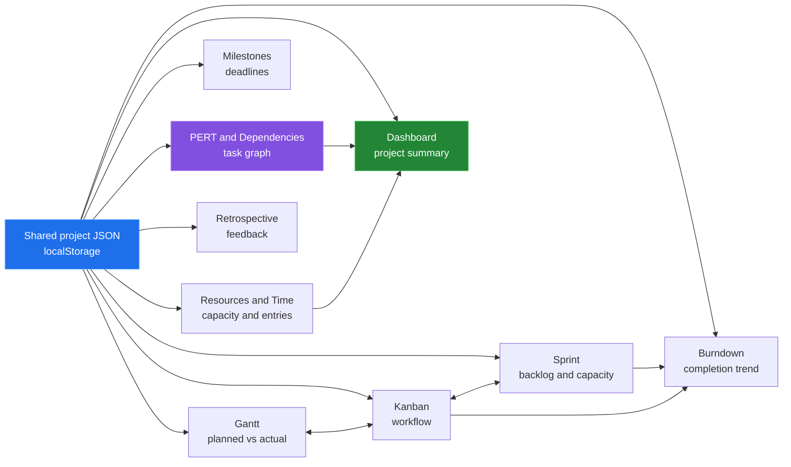
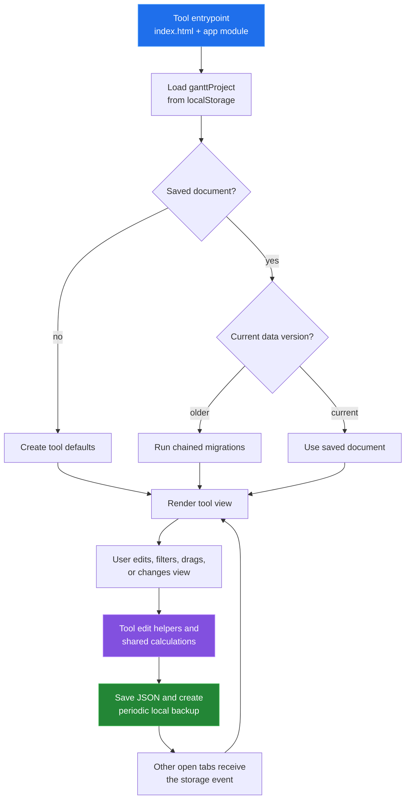

# Project Planning Tools

Project Planning Tools is a collection of browser-based views over one shared
project JSON document. It covers planning, execution, delivery tracking,
capacity, time, dependencies, and retrospectives while keeping the working
copy in the browser. The tools are plain HTML, CSS, and JavaScript modules, so
the repository is also easy to inspect, serve locally, and extend.



## Quick start

ES modules need an HTTP origin. From the repository root:

```bash
python3 -m http.server 8765
```

Open <http://localhost:8765>. In a Linux container, all 12 entrypoints (the
landing page and 11 tools) returned HTTP 200; see
[docs/measurement.md](docs/measurement.md).

## Architecture

Every tool follows the same load, migrate, render, edit, and save path. The
tool-specific app owns view state; the shared unified-data module owns the
cross-tool rules and migrations.



The detailed data relationships are in [the data model write-up](docs/data-model.md),
and the shared lifecycle is described in [architecture.md](docs/architecture.md).

## Capability table

| Tool | Input | Output | Reach for it when |
|---|---|---|---|
| [Gantt](tools/gantt/index.html) | Tasks, categories, planned and reality weeks | Timeline grid and variance view | You need a schedule and planned-vs-actual comparison |
| [Kanban](tools/kanban/index.html) | Tasks and workflow columns | Drag-and-drop work board | You need to move work through a workflow |
| [Sprint](tools/sprint/index.html) | Tasks, story points, and sprints | Backlog, sprint board, and velocity | You need to commit backlog work to a sprint |
| [Burndown](tools/burndown/index.html) | Sprint tasks and completion timestamps | Ideal and actual progress chart | You need to see remaining work over a sprint |
| [Time Tracker](tools/time-tracker/index.html) | Timer actions and time entries | Daily, weekly, and report views | You need recorded effort against tasks |
| [Resource Calendar](tools/resource-calendar/index.html) | Team members and availability entries | Week/month capacity calendar | You need to see team availability |
| [Milestone Tracker](tools/milestone-tracker/index.html) | Milestone tasks and dependencies | Timeline and status cards | You need deadline-focused project checkpoints |
| [Retrospective](tools/retrospective/index.html) | Retrospective items and votes | Grouped feedback board and actions | You need to turn sprint feedback into actions |
| [PERT](tools/pert/index.html) | Tasks and dependency edges | Network, PERT values, and critical path | You need schedule impact and slack analysis |
| [Dependencies](tools/dependencies/index.html) | Tasks and dependency edges | Status-oriented dependency network | You need a focused dependency map |
| [Dashboard](tools/dashboard/index.html) | All shared project collections | Health, velocity, milestones, and capacity cards | You need a compact project overview |

## Results

The checked-in script [devtools/measure_docs.py](devtools/measure_docs.py) reports
facts from tracked files and tool entrypoints:

| Measurement | Result |
|---|---:|
| Tool entrypoints | 11 |
| Navigation entries | 11 |
| Tracked HTML/CSS/JS files | 111 |
| Tracked app source bytes | 1,086,718 |
| Tracked app source lines | 39,553 |
| Current data version | 13 |
| Migration steps registered | 9 |
| External script URLs | 2 |

The external scripts are ELK.js and vis-network, used by the graph views.
These are repository facts, not browser timing. The run is described in
[docs/measurement.md](docs/measurement.md).

## Repository layout

```text
shared/
├── css/                 shared tokens and interface components
└── js/                  storage, migration, sync, export, and navigation
tools/
├── gantt/               planned versus actual timeline
├── kanban/              workflow board
├── sprint/              backlog and sprint planning
├── burndown/            sprint progress chart
├── time-tracker/        time entries and reports
├── resource-calendar/   availability and capacity
├── milestone-tracker/   deadline-focused task view
├── retrospective/      feedback and action items
├── pert/                critical-path analysis
├── dependencies/        dependency network
└── dashboard/           cross-tool summary
devtools/
├── measure_docs.py      repository counts
├── timer-check.mjs      headless-browser check of the Time Tracker timer
└── linux-run.sh         runs both in Linux containers
docs/                    diagrams and subsystem write-ups
```

See [docs/README.md](docs/README.md) for the documentation index.

## Known limitations

- Data is local to the browser origin. There is no server, shared workspace,
  authentication, or multi-user conflict resolution.
- ES modules require a local HTTP server; opening an entrypoint directly from
  the file system is not the supported path.
- The core app is local-first, but fresh loads of the landing page fetch Google
  Fonts, and the graph tools fetch ELK.js and vis-network from unpkg. An
  environment without those resources will not have the same presentation or
  graph layout behavior until the resources are available or cached.
- Imported documents are migrated in place to the current data format. Keep a
  JSON export before testing an old or experimental document.
- Timer entries are stored as `HH:MM` start and end times, so a saved
  duration comes from those truncated times, not from the exact elapsed time.
  Timers under one minute are rejected since
  [`0b4ad44`](https://github.com/Bissbert/project-planning-tools/commit/0b4ad44).
