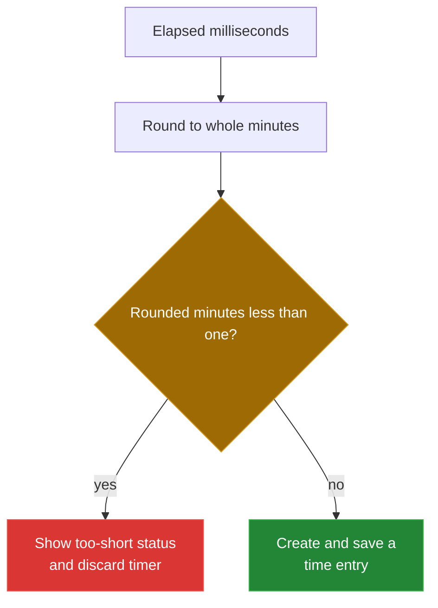

[← back to the documentation index](README.md)

# Bugs found during the documentation pass

This file records an existing behavior issue found while checking the
documentation against the source. No application source file was changed.



## Timer accepts sub-minute entries

**File and line:** tools/time-tracker/js/time-app.js:225-231

**What happens:** stopTimer rounds elapsed milliseconds to the nearest whole
minute before checking whether the result is less than one. A timer stopped
after the rounding threshold but before a full minute is therefore accepted and
saved as a one-minute entry, even though the status message describes entries
shorter than one minute as too short.

**How to reproduce:** In the timer path, stop a running timer before a full
minute has elapsed. The same calculation used by the source can be reproduced
without a browser:

```bash
node -e 'for (const ms of [30000, 59000, 60000]) console.log(ms, Math.round(ms / 60000));'
```

The command produced:

```text
30000 1
59000 1
60000 1
```

The documentation therefore describes the current rounding behavior rather than
claiming that every sub-minute entry is rejected.

**Fix I would have made:**

```diff
diff --git a/tools/time-tracker/js/time-app.js b/tools/time-tracker/js/time-app.js
--- a/tools/time-tracker/js/time-app.js
+++ b/tools/time-tracker/js/time-app.js
@@
-  const totalMinutes = Math.round(totalMs / 60000);
+  const totalMinutes = Math.floor(totalMs / 60000);
@@
   if (totalMinutes < 1) {
     statusManager.show('Entry too short (< 1 minute)');
     resetTimer();
     return;
   }
@@
   // Create entry
@@
   const entry = addTimeEntry(projectData, {
@@
   });
