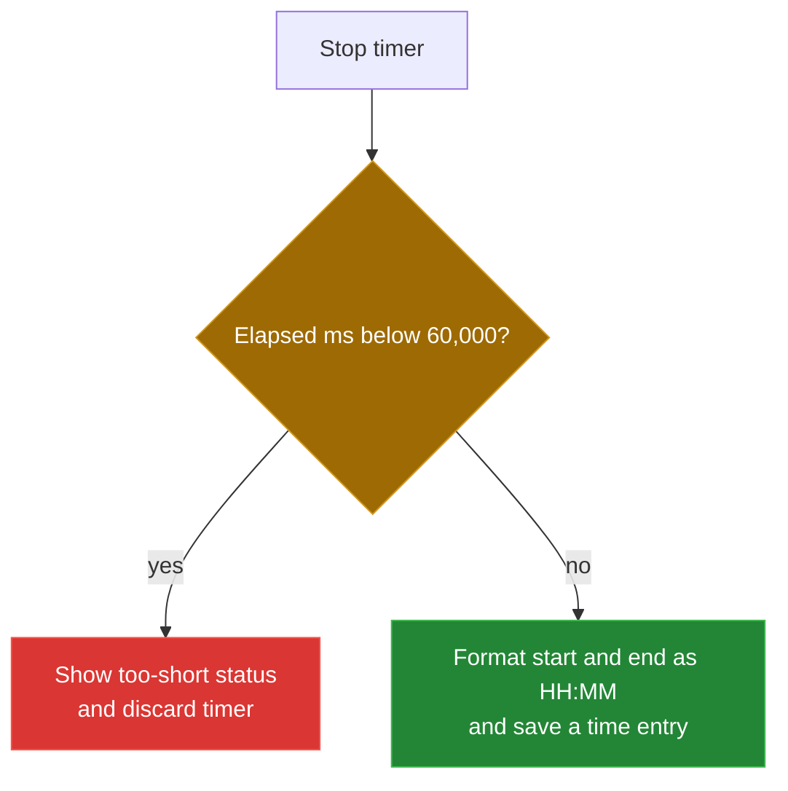

[← back to the documentation index](README.md)

# Bugs found

| Entry | Status |
|---|---|
| Timer accepts sub-minute entries | Fixed in [`0b4ad44`](https://github.com/Bissbert/project-planning-tools/commit/0b4ad44) |

## Timer accepts sub-minute entries

**Status:** fixed in [`0b4ad44`](https://github.com/Bissbert/project-planning-tools/commit/0b4ad44).

**File:** `tools/time-tracker/js/time-app.js` (`stopTimer`)

**What happened:** `stopTimer` rounded the elapsed milliseconds to the nearest
whole minute and rejected only results below one. A timer stopped after 30 to
59 seconds rounded to one minute and was saved, although the status message
says entries under one minute are too short.

**What changed:** `stopTimer` now checks the raw elapsed time first. Anything
under 60,000 ms shows "Entry too short (< 1 minute)" and discards the timer,
before any clock string is formatted or any entry is created.



**Check:** [`devtools/timer-check.mjs`](../devtools/timer-check.mjs) drives the
Time Tracker in headless Chromium on Linux with a fake clock. It stops the
timer once after 59 seconds and once after 61 seconds
(see [Measurement](measurement.md)):

```text
stop after 59s: display 00:00:59, entries 0 -> 0, status "Entry too short (< 1 minute)"
stop after 61s: display 00:01:01, entries 0 -> 1, status "Logged 00:01:01"
  saved entry: 2026-09-24 10:01-10:02
```

**Still open, by design:** the saved entry stores start and end as `HH:MM`
strings, so its duration comes from those truncated times, not from the
elapsed milliseconds. The 61-second run above was saved as `10:01-10:02`.
Whether to store exact durations is a separate behavior decision.
