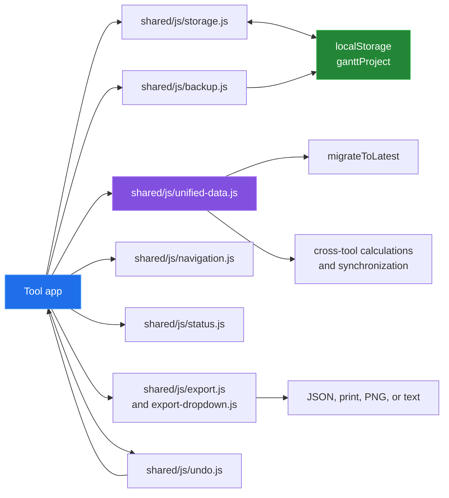

[← back to the documentation index](README.md)

# Shared architecture

Each tool is a self-contained HTML entrypoint with an app module, render
helpers, edit helpers where needed, and tool-specific CSS. The shared modules
give those entrypoints the same persistence, migration, navigation, export,
status, and undo conventions.

## Lifecycle

On startup, the app initializes its managers and navigation, loads the shared
storage key, and either uses a tool default or migrates the saved document.
After rendering, edits are recorded for undo, written back to storage, and
usually mirrored into a periodic backup. A storage event lets another open tab
reload the current document.

The migration registry in unified-data.js upgrades older documents in order. It
adds board data, sprint fields, time entries, calendar data, ISO sprint dates,
retrospectives, task dependencies, and the current retrospective item shape.
The current version and registered migration count are measured in
[devtools/measure_docs.py](../devtools/measure_docs.py), not copied into this
description by hand.

## Shared module responsibilities

| Module | Responsibility |
|---|---|
| storage.js | Read, write, remove, and test the shared localStorage key |
| unified-data.js | Data versioning, migrations, calculations, and cross-tool sync |
| backup.js | Keep a bounded history of serialized project snapshots |
| undo.js | Keep serialized undo and redo states for an app session |
| export.js | Download/read JSON and text, sanitize names, and invoke print |
| export-dropdown.js | Turn export actions into a shared menu component |
| navigation.js | Populate the tool switcher and keyboard behavior |
| status.js | Display transient save and action feedback |

The graph tools add browser-loaded layout libraries in their HTML entrypoints;
the measurement script records those external URLs. Everything else in the
repository is shipped as source in the repository.

## What is deliberately not shared

Rendering and interaction stay inside each tool. This keeps a Gantt grid,
Kanban board, SVG chart, calendar, and dependency network free to use the
interaction model that fits it. The cost is that tool-specific defaults and
some edit flows repeat small pieces of orchestration code.
