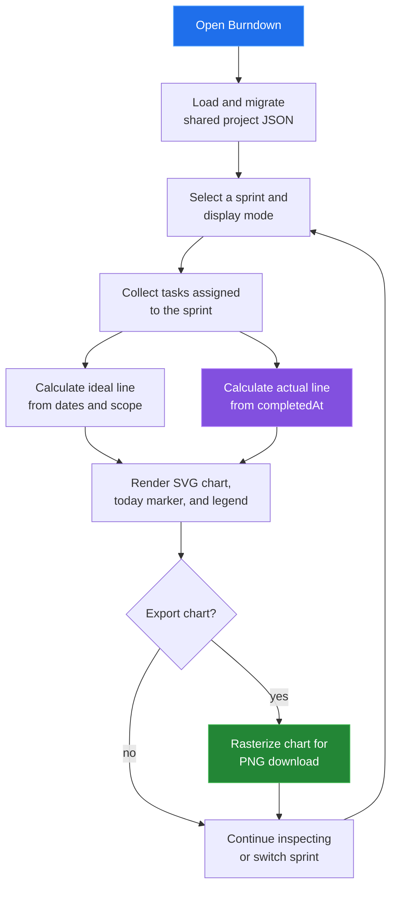

[← back to the documentation index](README.md)

# Burndown

Burndown turns sprint scope and completion timestamps into a chart. The ideal
line is calculated from the sprint interval; the actual line is calculated
from which sprint tasks were completed by each date.

## Data boundary

| Reads | Writes | Produces |
|---|---|---|
| Sprints, assigned tasks, story points, and completion timestamps | No project data during chart inspection | Ideal and actual remaining-work series |

The actual series stops at the earlier of the sprint end and the current date.
The current remaining summary is based on board completion state, while the
historical line uses completion timestamps.

## Reach for it when

Use Burndown to ask whether remaining sprint work is falling at the intended
rate. Use Dashboard for a wider project summary.

Source: [tools/burndown/index.html](../tools/burndown/index.html),
[burndown-app.js](../tools/burndown/js/burndown-app.js), and
[unified-data.js](../shared/js/unified-data.js).
