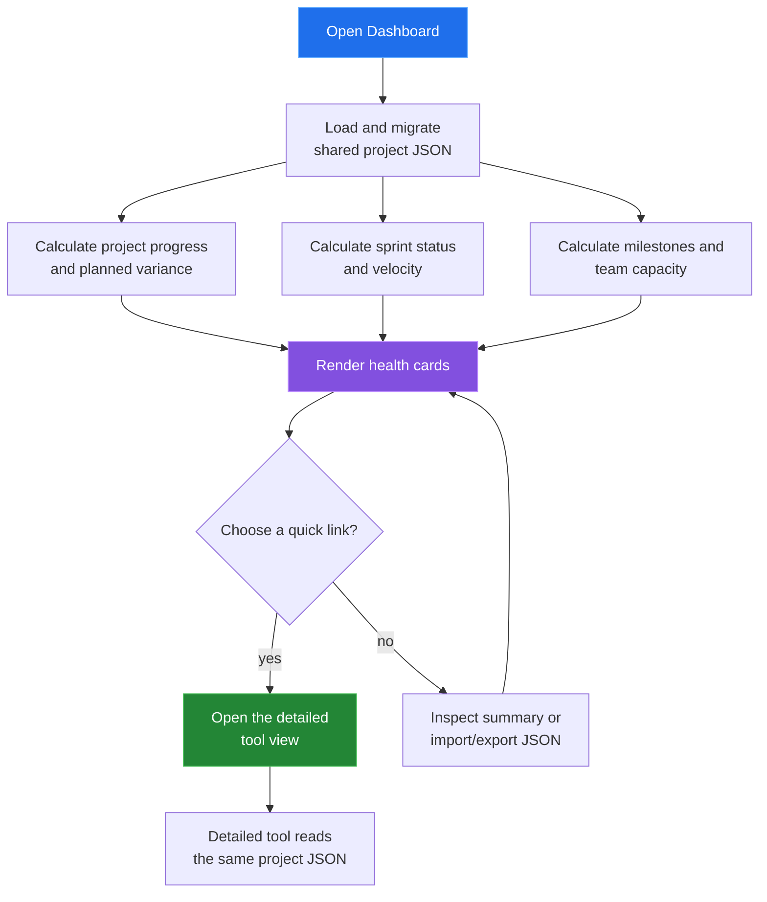

[← back to the documentation index](README.md)

# Dashboard

Dashboard is a read-oriented summary of the shared project document. It
combines progress, sprint state, task distribution, milestones, velocity, and
team capacity, then links back to the detailed tools.

## Data boundary

| Reads | Writes | Produces |
|---|---|---|
| Project, tasks, sprints, milestones, team, and calendar data | Imported project JSON when requested | Health, status, distribution, velocity, milestone, and capacity cards |

Dashboard does not maintain a second summary store. Reopening it or receiving a
storage event recalculates the cards from the shared document.

## Reach for it when

Use Dashboard when you need a starting point for project review. Follow a card
to the specialized tool when the summary exposes a schedule, dependency,
capacity, or delivery question.

Source: [tools/dashboard/index.html](../tools/dashboard/index.html),
[dashboard-app.js](../tools/dashboard/js/dashboard-app.js), and
[dashboard-render.js](../tools/dashboard/js/dashboard-render.js).
