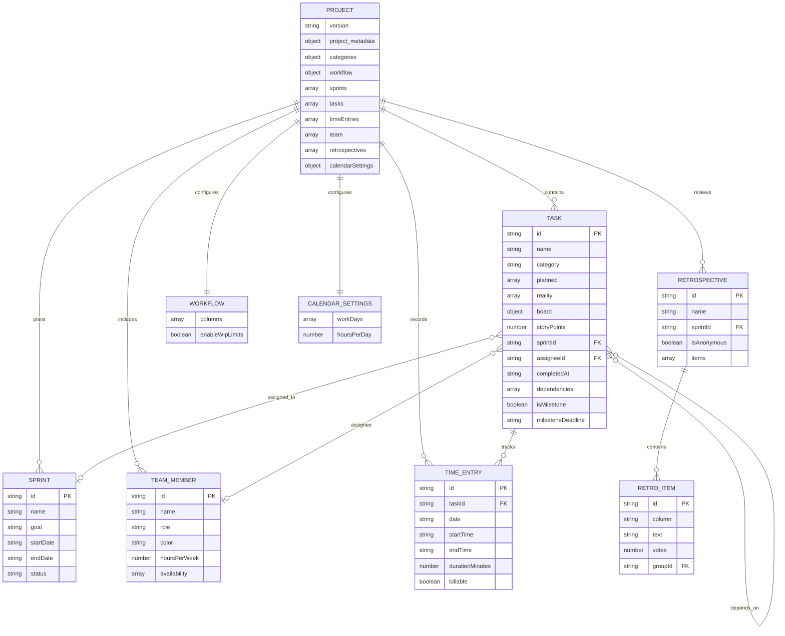

[← back to the documentation index](README.md)

# Shared project data model

The tools exchange one JSON document. The conceptual model below follows the
fields read and written by the shared data module and the tool edit helpers.
categories and workflow.columns are embedded collections rather than top-level
entities, so they are shown as attributes on PROJECT and WORKFLOW.

## Task is the shared pivot

The same task can be scheduled in Gantt, moved through Kanban, assigned to a
Sprint, counted by Burndown, linked in PERT and Dependencies, promoted to a
Milestone, and associated with Time Tracker entries. That is why task fields
carry both planning data (planned and reality) and execution data (board,
completedAt, and sprintId).

## Derived values

Some views calculate rather than store their display values:

- Kanban column and task status can be derived from planned and reality weeks.
- Burndown actuals are derived from completedAt; sprint burndown snapshots are
  not the source of truth.
- PERT duration is based on the number of planned weeks, with a fallback for a
  task without planned weeks. Forward and backward passes then derive slack.
- Resource capacity is calculated from member availability and calendar
  settings.
- Milestone status and progress can be calculated from deadline and dependency
  state, with explicit milestone overrides where the tool supports them.

## Import and migration boundary

JSON import enters through the same migration path as localStorage. The app
sets the document to the current data version after migration and then saves
it. Export writes the whole document, so an export is the portable boundary
between browser origins and backups.
