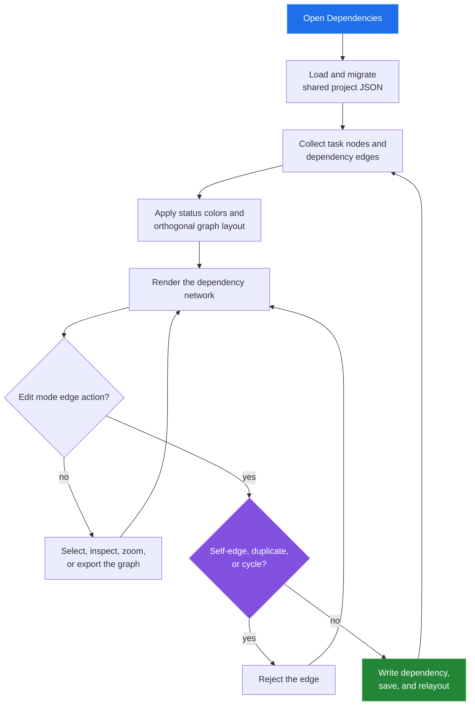

[← back to the documentation index](README.md)

# Dependencies

Dependencies is the focused network view. It uses the same task dependency
arrays as PERT, but emphasizes task status and safe edge editing rather than
slack calculations.

## Data boundary

| Reads | Writes | Produces |
|---|---|---|
| Task names, board status, categories, and dependency arrays | Dependency arrays on task records | Status-colored dependency network and node details |

The graph is a view over task IDs. Removing an edge changes the task record and
therefore changes the PERT graph as well.

## Reach for it when

Use Dependencies for a readable map of what blocks what. It is useful during
editing because invalid edge shapes are rejected before they are persisted.

Source: [tools/dependencies/index.html](../tools/dependencies/index.html),
[deps-app.js](../tools/dependencies/js/deps-app.js), and
[deps-vis.js](../tools/dependencies/js/deps-vis.js).
