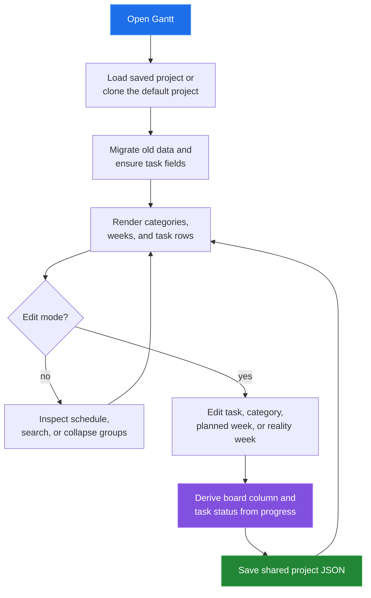

[← back to the documentation index](README.md)

# Gantt

The Gantt tool is the schedule editor. It renders each task against planned and
reality weeks, groups tasks by category, and uses the shared synchronization
rules so progress is visible in Kanban and Burndown.

## Data boundary

| Reads | Writes | Produces |
|---|---|---|
| Project dates, categories, workflow, and task planning fields | Task arrays, category order, board state, and completion timestamp | Schedule grid, variance indicators, and task editor |

Planned weeks describe intended work. Reality weeks describe what happened.
When a reality change moves a task into or out of Done, shared synchronization
also sets or clears completedAt for downstream Burndown calculations.

## Reach for it when

Use Gantt when the question is “when should this happen, and how does that
compare with what happened?” Use Kanban for flow state and Sprint for
commitment and backlog ordering.

Source: [tools/gantt/index.html](../tools/gantt/index.html),
[gantt-app.js](../tools/gantt/js/gantt-app.js), and
[gantt-data.js](../tools/gantt/js/gantt-data.js).
