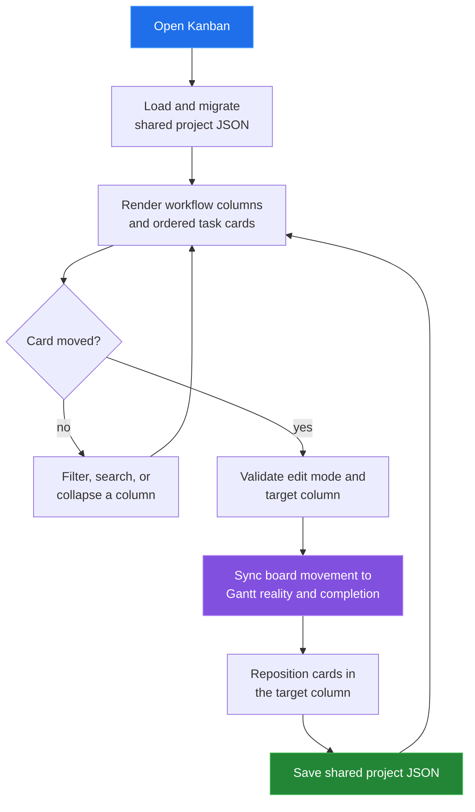

[← back to the documentation index](README.md)

# Kanban

Kanban is the workflow view over the same task records used by Gantt and
Sprint. Columns come from the workflow configuration; moving a card updates
the task board position and synchronizes progress-related fields.

## Data boundary

| Reads | Writes | Produces |
|---|---|---|
| Workflow columns and task board fields | columnId, position, reality, and completedAt | Ordered cards grouped by workflow state |

Moving to In Progress may seed the current week when the task has no reality
weeks. Moving to Done records completion time; moving back out clears it.
These changes are intentionally visible to the timeline and progress views.

## Reach for it when

Use Kanban when the team needs a current flow state and a direct drag gesture.
The board is not a separate task database; it is another projection of the
shared task collection.

Source: [tools/kanban/index.html](../tools/kanban/index.html) and
[kanban-app.js](../tools/kanban/js/kanban-app.js).
