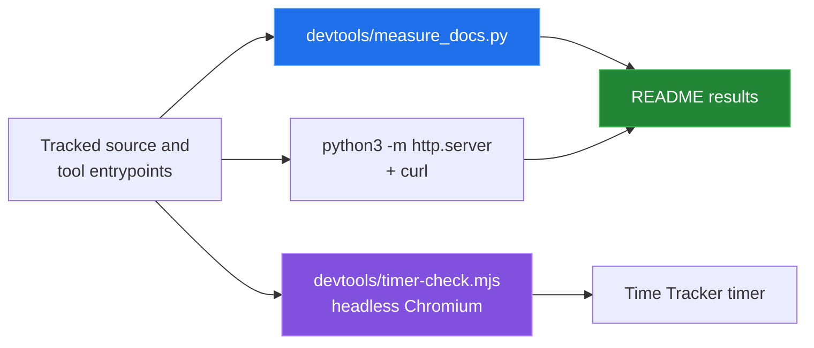

[← back to the documentation index](README.md)

# Measurement

Every number in this documentation comes from one script run in Linux
containers:

```bash
sh devtools/linux-run.sh > media/captures/linux-run.txt
```

[`devtools/linux-run.sh`](../devtools/linux-run.sh) mounts the repository
read-only, copies it, and runs three checks. The full output is
[`media/captures/linux-run.txt`](../media/captures/linux-run.txt); the blocks
below are taken from it.

## Environment

| | |
|---|---|
| Kernel | Linux 6.5.11-linuxkit, aarch64 (Docker Desktop VM) |
| Python container | `python:3.12-slim-bookworm` (`sha256:392307d2…23564e`), Python 3.12.14 |
| Browser container | `mcr.microsoft.com/playwright:v1.55.0-noble` (`sha256:b27e719e…d7fb29`), Node 22.18.0, Chromium 140.0.7339.16 |
| Date | 2026-09-24 |



## Repository facts

[`devtools/measure_docs.py`](../devtools/measure_docs.py) counts tool
entrypoints, compares them with the navigation registry, counts tracked
HTML/CSS/JS files with their bytes and lines, reads the data version and
migration registry, and extracts external script URLs. It asks Git for the
tracked paths, so untracked project exports are not counted.

```text
tool_entrypoints=11
tool_names=burndown,dashboard,dependencies,gantt,kanban,milestone-tracker,pert,resource-calendar,retrospective,sprint,time-tracker
navigation_tools=11
source_files=111
source_bytes=1086718
source_lines=39553
data_version=13
migration_steps=9
storage_key=ganttProject
external_script_urls=2
external_script=https://unpkg.com/elkjs@0.9.3/lib/elk.bundled.js
external_script=https://unpkg.com/vis-network/standalone/umd/vis-network.min.js
```

The byte and line totals change with every source edit. Run the script again
to refresh them.

## Quick start

`python3 -m http.server 8765`, then every entrypoint fetched with `curl`:

```text
index.html                               200
tools/burndown/index.html                200
tools/dashboard/index.html               200
tools/dependencies/index.html            200
tools/gantt/index.html                   200
tools/kanban/index.html                  200
tools/milestone-tracker/index.html       200
tools/pert/index.html                    200
tools/resource-calendar/index.html       200
tools/retrospective/index.html           200
tools/sprint/index.html                  200
tools/time-tracker/index.html            200
```

## Time Tracker timer

[`devtools/timer-check.mjs`](../devtools/timer-check.mjs) serves the repository,
opens the Time Tracker in headless Chromium with Playwright's fake clock,
turns on edit mode, and stops the timer after 59 and after 61 seconds:

```text
stop after 59s: display 00:00:59, entries 0 -> 0, status "Entry too short (< 1 minute)"
stop after 61s: display 00:01:01, entries 0 -> 1, status "Logged 00:01:01"
  saved entry: 2026-09-24 10:01-10:02
page errors: none
```

This confirms the fix in
[`0b4ad44`](https://github.com/Bissbert/project-planning-tools/commit/0b4ad44).

## Not covered

- Browser timing or rendering performance.
- The other ten tools in a browser; they were only fetched over HTTP.
- ELK.js and vis-network behavior. Their URLs are read from the graph tool
  entrypoints; the libraries themselves were not loaded.
