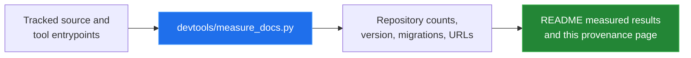

[← back to the documentation index](README.md)

# Measurement and provenance

This repository intentionally reports only numbers that can be reproduced from
the checked-in source. The measurement script uses the standard library and
asks Git for the tracked paths, so an unrelated untracked project export in a
developer worktree is not included.

## Repository measurements

Run from the repository root:

```bash
python3 devtools/measure_docs.py
```

The command counts tool entrypoints, compares the entrypoint directories with
the navigation registry, counts tracked HTML/CSS/JS files, sums their bytes and
newline-delimited lines, reads the current data version and migration registry,
and extracts external script URLs from the tool entrypoints.



The output used for this pass was:

```text
tool_entrypoints=11
tool_names=burndown,dashboard,dependencies,gantt,kanban,milestone-tracker,pert,resource-calendar,retrospective,sprint,time-tracker
navigation_tools=11
source_files=111
source_bytes=1081447
source_lines=39529
data_version=13
migration_steps=9
storage_key=ganttProject
external_script_urls=2
external_script=https://unpkg.com/elkjs@0.9.3/lib/elk.bundled.js
external_script=https://unpkg.com/vis-network/standalone/umd/vis-network.min.js
```

The source totals are a snapshot of the repository state at the time of this
pass. Run the script again after source changes; the output is expected to
change.

## Quick-start verification

The quick start was exercised with:

```bash
python3 -m http.server 8765
curl --fail --silent --show-error http://127.0.0.1:8765/index.html
curl --fail --silent --show-error http://127.0.0.1:8765/tools/gantt/index.html
```

Both requests completed successfully. This verifies static serving and the
entrypoint responses, not interactive behavior in a browser.

## What was not measured

- No runtime performance benchmark was run.
- No browser automation or visual regression run was available in this pass.
- No animation was captured. The repository therefore ships Mermaid diagrams,
  not a GIF pretending to be a recording of a real session.
- The unpkg libraries were not bundled or benchmarked locally; their URLs were
  read from the graph tool entrypoints.
