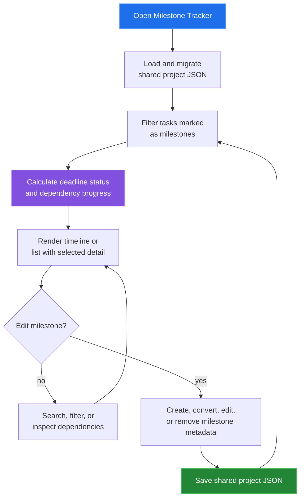

[← back to the documentation index](README.md)

# Milestone Tracker

Milestone Tracker is a deadline-focused projection of tasks. A milestone is a
task marked with milestone metadata; its status and progress can reflect
deadline pressure and the completion of its dependencies.

## Data boundary

| Reads | Writes | Produces |
|---|---|---|
| Task milestone flags, deadlines, dependencies, and board state | Milestone fields on task records | Timeline markers, status labels, and dependency progress |

Milestones do not form a separate top-level collection. Converting a task keeps
the task and changes its milestone fields, so other tools continue to see the
same task identity.

## Reach for it when

Use Milestone Tracker for a high-level delivery conversation: which checkpoints
are near, delayed, complete, or dependent on unfinished work.

Source: [tools/milestone-tracker/index.html](../tools/milestone-tracker/index.html),
[milestone-app.js](../tools/milestone-tracker/js/milestone-app.js), and
[unified-data.js](../shared/js/unified-data.js).
