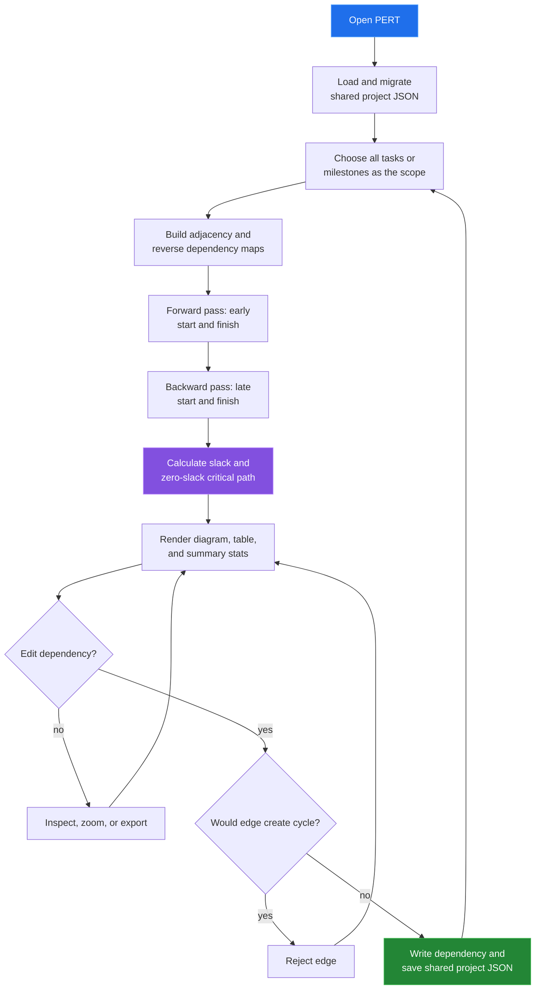

[← back to the documentation index](README.md)

# PERT Chart

PERT builds a directed graph from task dependencies, then computes early and
late dates, slack, and the critical path. It can analyze all tasks or the
milestone subset and presents the result as a network and table.

## Data boundary

| Reads | Writes | Produces |
|---|---|---|
| Tasks, planned weeks, dependencies, and milestone flags | Dependency arrays on tasks | Network nodes, PERT values, slack, and critical path |

Task duration is derived from planned-week data. A dependency edge is accepted
only when it is not a duplicate, self-edge, or cycle-producing edge.

## Reach for it when

Use PERT when dependency order changes schedule risk and you need to know which
tasks have no slack. Use Dependencies when the graph relationship itself is the
main question and PERT calculations would be distracting.

Source: [tools/pert/index.html](../tools/pert/index.html),
[pert-app.js](../tools/pert/js/pert-app.js), and
[pert-calc.js](../tools/pert/js/pert-calc.js).
