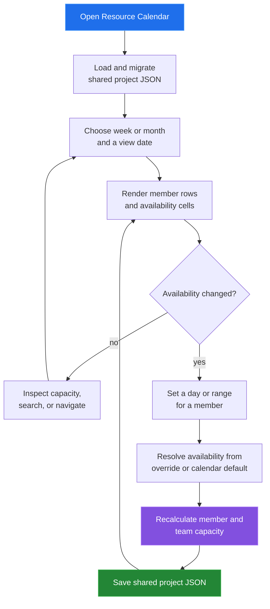

[← back to the documentation index](README.md)

# Resource Calendar

Resource Calendar turns team members, working days, and date-specific
availability into week and month capacity views. A missing date-specific entry
falls back to the calendar defaults.

## Data boundary

| Reads | Writes | Produces |
|---|---|---|
| Team members, availability entries, and calendar settings | Member records and date-specific availability | Calendar cells, per-member totals, and team capacity |

Availability types include the default available state, partial availability,
unavailability, holidays, and weekends. Capacity is derived from hours, work
days, and the selected date range.

## Reach for it when

Use Resource Calendar to understand whether a team can absorb planned work.
Use Time Tracker for historical effort rather than planned capacity.

Source: [tools/resource-calendar/index.html](../tools/resource-calendar/index.html),
[calendar-app.js](../tools/resource-calendar/js/calendar-app.js), and
[unified-data.js](../shared/js/unified-data.js).
