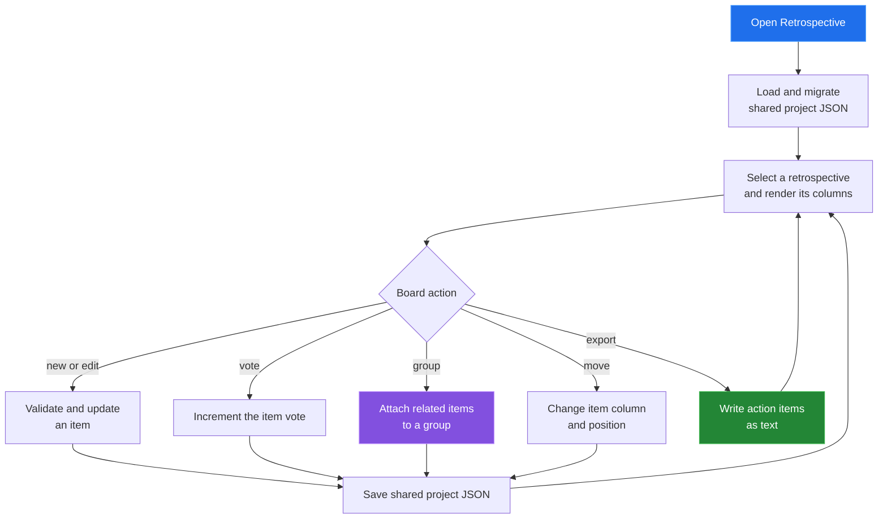

[← back to the documentation index](README.md)

# Retrospective Board

Retrospective Board stores feedback items in three workflow columns. Items can
be voted on, grouped, moved, edited, and exported as action-item text without
changing the task board.

## Data boundary

| Reads | Writes | Produces |
|---|---|---|
| Retrospectives, sprint links, and item arrays | Retro metadata, item column, position, grouping, and votes | Feedback board and exported action items |

The current item shape is a flat array with a column field. Migration also
accepts the older column-object shape and normalizes it before rendering.

## Reach for it when

Use this tool after an iteration to collect observations and turn the action
column into a portable follow-up list. Link a retrospective to a sprint when
the review should be discoverable from iteration context.

Source: [tools/retrospective/index.html](../tools/retrospective/index.html),
[retro-app.js](../tools/retrospective/js/retro-app.js), and
[retro-edit.js](../tools/retrospective/js/retro-edit.js).
