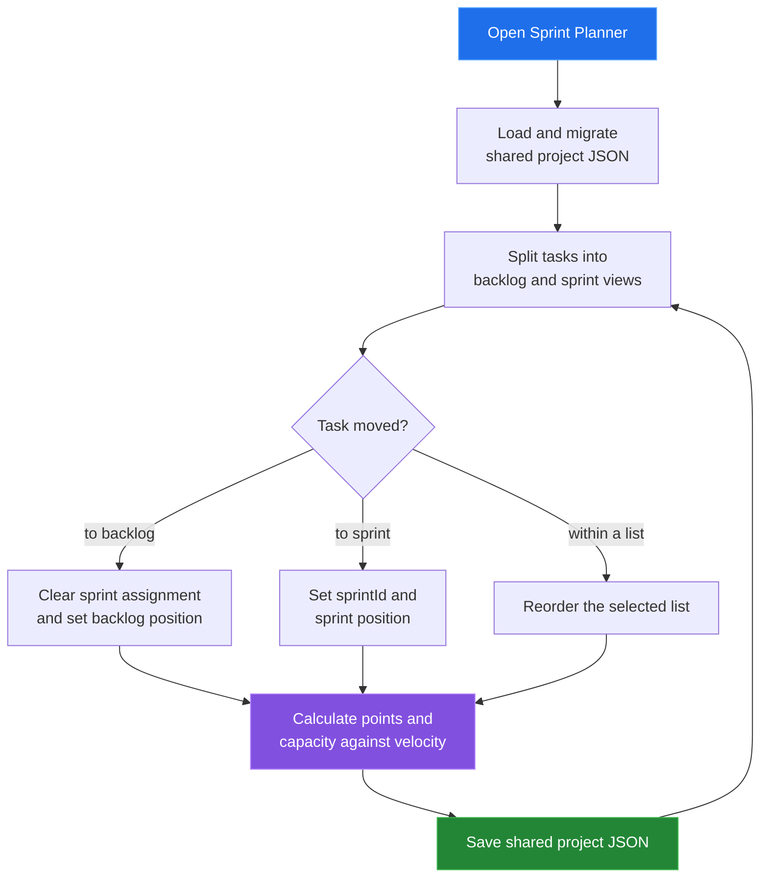

[← back to the documentation index](README.md)

# Sprint planner

Sprint Planner separates the product backlog from sprint commitments. It keeps
the task identity shared with Gantt and Kanban while using sprint assignment,
story points, and completion state to calculate capacity and velocity.

## Data boundary

| Reads | Writes | Produces |
|---|---|---|
| Tasks, sprints, workflow state, and story points | sprintId, backlogPosition, task order, sprint metadata | Backlog, sprint board, point totals, and velocity history |

Velocity is derived from completed sprints and the story points of their Done
tasks. It is a planning signal, not a second copy of task data.

## Reach for it when

Use Sprint Planner to decide what enters an iteration, compare a commitment with
available velocity, and move unfinished work back to the backlog.

Source: [tools/sprint/index.html](../tools/sprint/index.html),
[sprint-app.js](../tools/sprint/js/sprint-app.js), and
[sprint-edit.js](../tools/sprint/js/sprint-edit.js).
