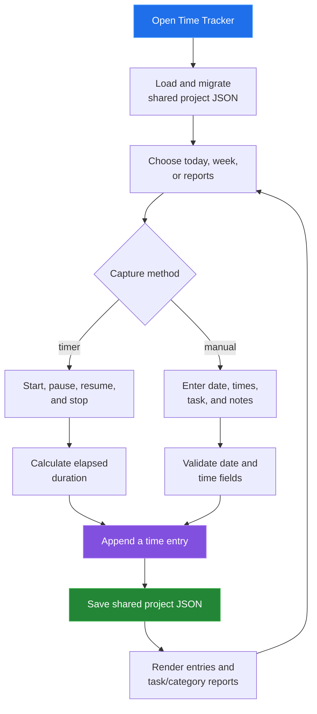

[← back to the documentation index](README.md)

# Time Tracker

Time Tracker records effort either from a running timer or a manual entry.
Entries remain in the shared project document and can be viewed by day, week,
or report grouping.

## Data boundary

| Reads | Writes | Produces |
|---|---|---|
| Tasks, categories, and timeEntries | Time entry date, interval, task link, notes, and billable flag | Daily/week lists and grouped duration reports |

The timer is transient UI state until it is stopped. A timer stopped before one
full minute shows "Entry too short (< 1 minute)" and is discarded. A longer one
becomes a time entry with `HH:MM` start and end times, so the saved duration is
rounded to those clock minutes, not taken from the elapsed milliseconds. A
61-second run is saved as `10:01-10:02`. The one-minute check was added in
[`0b4ad44`](https://github.com/Bissbert/project-planning-tools/commit/0b4ad44).

## Reach for it when

Use Time Tracker when the important record is effort spent, not only task
status. Associate an entry with a task when reports should roll up by task or
category.

Source: [tools/time-tracker/index.html](../tools/time-tracker/index.html),
[time-app.js](../tools/time-tracker/js/time-app.js), and
[time-edit.js](../tools/time-tracker/js/time-edit.js).
